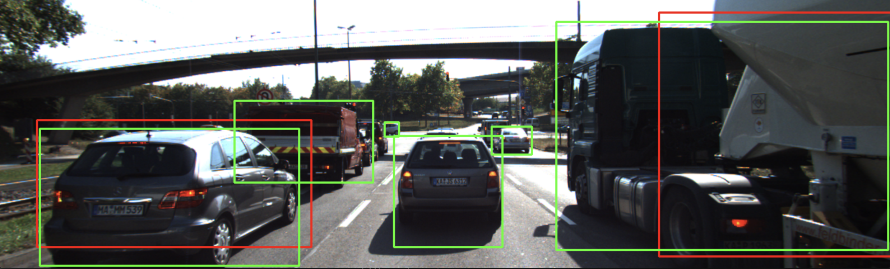
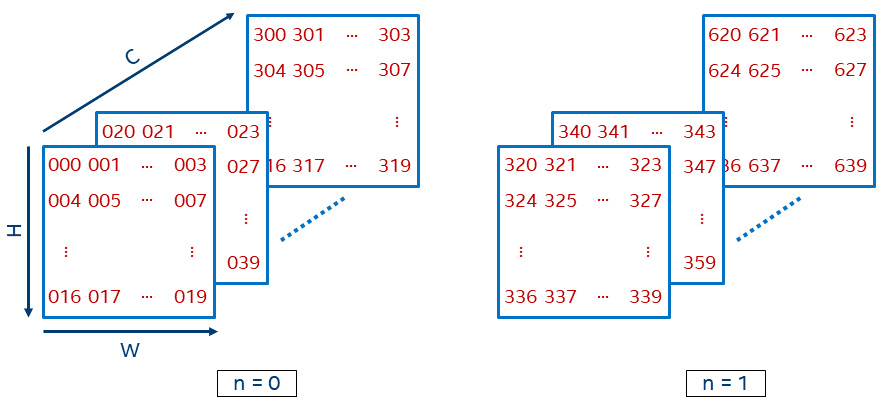

# **YOLOv3-Object-Detection-with-OpenCV**     



## Dependencies for Running Locally
* cmake >= 2.8
  * All OSes: [click here for installation instructions](https://cmake.org/install/)
* make >= 4.1 (Linux, Mac), 3.81 (Windows)
  * Linux: make is installed by default on most Linux distros
  * Mac: [install Xcode command line tools to get make](https://developer.apple.com/xcode/features/)
  * Windows: [Click here for installation instructions](http://gnuwin32.sourceforge.net/packages/make.htm)
* OpenCV >= 4.1
  * This must be compiled from source using the `-D OPENCV_ENABLE_NONFREE=ON` cmake flag for testing the SIFT and SURF detectors.
  * The OpenCV 4.1.0 source code can be found [here](https://github.com/opencv/opencv/tree/4.1.0)
* gcc/g++ >= 5.4
  * Linux: gcc / g++ is installed by default on most Linux distros
  * Mac: same deal as make - [install Xcode command line tools](https://developer.apple.com/xcode/features/)
  * Windows: recommend using [MinGW](http://www.mingw.org/)

### Download yolov3.weights
link: https://pan.baidu.com/s/11kqtPdSWxyNHsm8nSPHqQg 

pass word: q4q6

put in directory YOLOv3-Object-Detection-with-OpenCV/dat/yolo/

## Basic Build Instructions

1. Clone this repo.
2. Make a build directory in the top level directory: `mkdir build && cd build`
3. Compile: `cmake .. && make`
4. Run it: `./detect_objects`.


## Wright up

#### 1、load the model weights as well as the associated model configuration

```cpp
    // load image from file
    cv::Mat img = cv::imread("./images/img1.png");

    // load class names from file
    string yoloBasePath = "./dat/yolo/";
    string yoloClassesFile = yoloBasePath + "coco.names";
    string yoloModelConfiguration = yoloBasePath + "yolov3.cfg";
    string yoloModelWeights = yoloBasePath + "yolov3.weights"; 

    vector<string> classes;
    ifstream ifs(yoloClassesFile.c_str());
    string line;
    while (getline(ifs, line)) classes.push_back(line);

    // load neural network
    cv::dnn::Net net = cv::dnn::readNetFromDarknet(yoloModelConfiguration, yoloModelWeights);
    net.setPreferableBackend(cv::dnn::DNN_BACKEND_OPENCV);
    net.setPreferableTarget(cv::dnn::DNN_TARGET_CPU);
```

After loading the network, the DNN backend is set to DNN_BACKEND_OPENCV. If OpenCV is built with Intel’s Inference Engine, DNN_BACKEND_INFERENCE_ENGINE should be used instead. The target is set to CPU in the code, as opposed to using DNN_TARGET_OPENCL, which would be the method of choice if a (Intel) GPU was available.

#### 2、Generate 4D Blob from Input Image

As data flows through the network, YOLO stores, communicates, and manipulates the information as "blobs".

The following example illustrates the memory structure of a blob with N=2, C=16 channels and height H=5 / width W=4.



The code below shows how an image loaded from the file is passed through the blobFromImage function to be converted into an input block for the neural network. The pixel values are scaled with a scaling factor of 1/255 to a target range of 0 to 1. It also adjusts the size of the image to the specified size of (416, 416, 416) without cropping.

```cpp
    // generate 4D blob from input image
    cv::Mat blob;
    double scalefactor = 1/255.0;
    cv::Size size = cv::Size(416, 416);
    cv::Scalar mean = cv::Scalar(0,0,0);
    bool swapRB = false;
    bool crop = false;
    cv::dnn::blobFromImage(img, blob, scalefactor, size, mean, swapRB, crop);
```


#### 3、*Run Forward Pass Through the Network*

As the next step, we have to pass the blob we just created to the network as its input. Then, we run the forward-function of OpenCV to perform a single forward-pass through the network. In order to do that, we need to identify the last layer of the network and provide the associated internal names to the function. This can be done by using the OpenCV function 'getUnconnectedOutLayers', which gives the names of all unconnected output layers, which are in fact the last layers of the network. The following code shows how this can be achieved:

```cpp
	// Get names of output layers
    vector<cv::String> names;
    vector<int> outLayers = net.getUnconnectedOutLayers(); // get indices of output layers, i.e. layers with unconnected outputs
    vector<cv::String> layersNames = net.getLayerNames(); // get names of all layers in the network

    names.resize(outLayers.size());
    for (size_t i = 0; i < outLayers.size(); ++i) // Get the names of the output layers in names
    {
        names[i] = layersNames[outLayers[i] - 1];
    }

    // invoke forward propagation through network
    vector<cv::Mat> netOutput;
    net.setInput(blob);
    net.forward(netOutput, names);
```

The result of the forward pass and thus the output of the network is a vector of size C (the number of blob classes) with the first four elements in each class representing the center in x, the center in y as well as the width and height of the associated bounding box. The fifth element represents the trust or confidence that the respective bounding box actually encloses an object. The remaining elements of the matrix are the confidence associated with each of the classes contained in the coco.cfg file. Further on in the code, each box is assigned to the class corresponding to the highest confidence.


#### 4、Scan through all bounding boxes and keep only the ones with high confidence

```cpp
 	// Scan through all bounding boxes and keep only the ones with high confidence
    float confThreshold = 0.20;
    vector<int> classIds;
    vector<float> confidences;
    vector<cv::Rect> boxes;
    for (size_t i = 0; i < netOutput.size(); ++i)
    {
        float* data = (float*)netOutput[i].data;
        for (int j = 0; j < netOutput[i].rows; ++j, data += netOutput[i].cols)
        {
            cv::Mat scores = netOutput[i].row(j).colRange(5, netOutput[i].cols);
            cv::Point classId;
            double confidence;

            // Get the value and location of the maximum score
            cv::minMaxLoc(scores, 0, &confidence, 0, &classId);
            if (confidence > confThreshold)
            {
                cv::Rect box; int cx, cy;
                cx = (int)(data[0] * img.cols);
                cy = (int)(data[1] * img.rows);
                box.width = (int)(data[2] * img.cols);
                box.height = (int)(data[3] * img.rows);
                box.x = cx - box.width/2; // left
                box.y = cy - box.height/2; // top

                boxes.push_back(box);
                classIds.push_back(classId.x);
                confidences.push_back((float)confidence);
            }
        }
    }
```


#### 5、Post-Processing of Network Output
The OpenCV library offers a ready-made function for the suppression of overlapping bounding boxes. This function is called NMSBoxes and it can be used as illustrated by the following short code sample:

```cpp
	// perform non-maxima suppression
    float nmsThreshold = 0.4;  // Non-maximum suppression threshold
    vector<int> indices;
    cv::dnn::NMSBoxes(boxes, confidences, confThreshold, nmsThreshold, indices);

```
